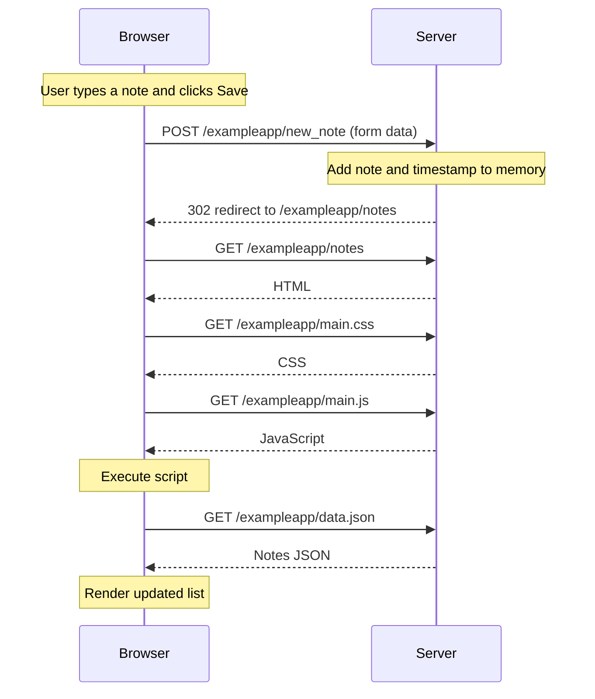

# 0.4 — Saving a note

Host: `https://studies.cs.helsinki.fi`. Requests below use paths on this host. Assumes caching is disabled.

```mermaid
sequenceDiagram
    participant B as Browser
    participant S as Server
    Note over B: User types a note and clicks Save
    B->>S: POST /exampleapp/new_note (form data)
    Note over S: Add note and timestamp to memory
    S-->>B: 302 redirect to /exampleapp/notes
    B->>S: GET /exampleapp/notes
    S-->>B: HTML
    B->>S: GET /exampleapp/main.css
    S-->>B: CSS
    B->>S: GET /exampleapp/main.js
    S-->>B: JavaScript
    Note over B: Execute script
    B->>S: GET /exampleapp/data.json
    S-->>B: Notes JSON
    Note over B: Render updated list
```
