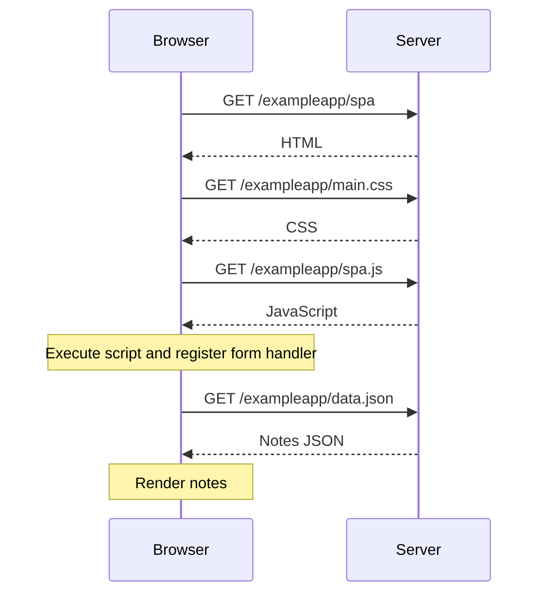

# 0.5 — Opening the SPA

Host: `https://studies.cs.helsinki.fi`. Assumes caching is disabled.

```mermaid
sequenceDiagram
    participant B as Browser
    participant S as Server
    B->>S: GET /exampleapp/spa
    S-->>B: HTML
    B->>S: GET /exampleapp/main.css
    S-->>B: CSS
    B->>S: GET /exampleapp/spa.js
    S-->>B: JavaScript
    Note over B: Execute script and register form handler
    B->>S: GET /exampleapp/data.json
    S-->>B: Notes JSON
    Note over B: Render notes
```
