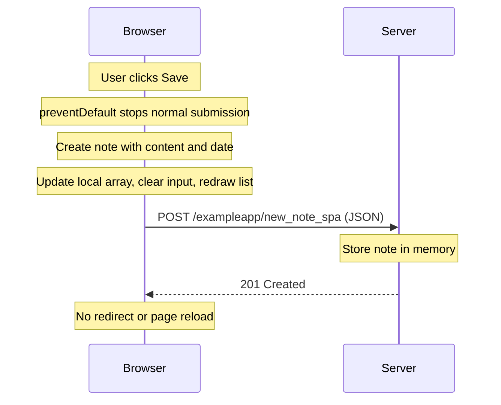

# 0.6 — Saving a note in the SPA

Host: `https://studies.cs.helsinki.fi`.

```mermaid
sequenceDiagram
    participant B as Browser
    participant S as Server
    Note over B: User clicks Save
    Note over B: preventDefault stops normal submission
    Note over B: Create note with content and date
    Note over B: Update local array, clear input, redraw list
    B->>S: POST /exampleapp/new_note_spa (JSON)
    Note over S: Store note in memory
    S-->>B: 201 Created
    Note over B: No redirect or page reload
```
